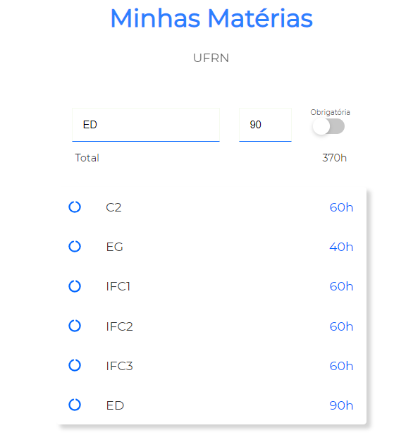

# Subjects SPA's

SPA that allows me to manage my university subjects by means of a CRUD coded with ExpressJS + Sequelize.

Click the subject to delete it from the list

Type subject's name onto the field and press `enter` to add it



This project was bootstrapped with [Create React App](https://github.com/facebook/create-react-app).

## Available Scripts

On the root directory, start the server

```bash
yarn dev
```

Then, on `client` folder, you can type

```bash
yarn start
```

For starting React application. Runs the app in the development mode. Open [http://localhost:3000](http://localhost:3000) to view it in the browser.
