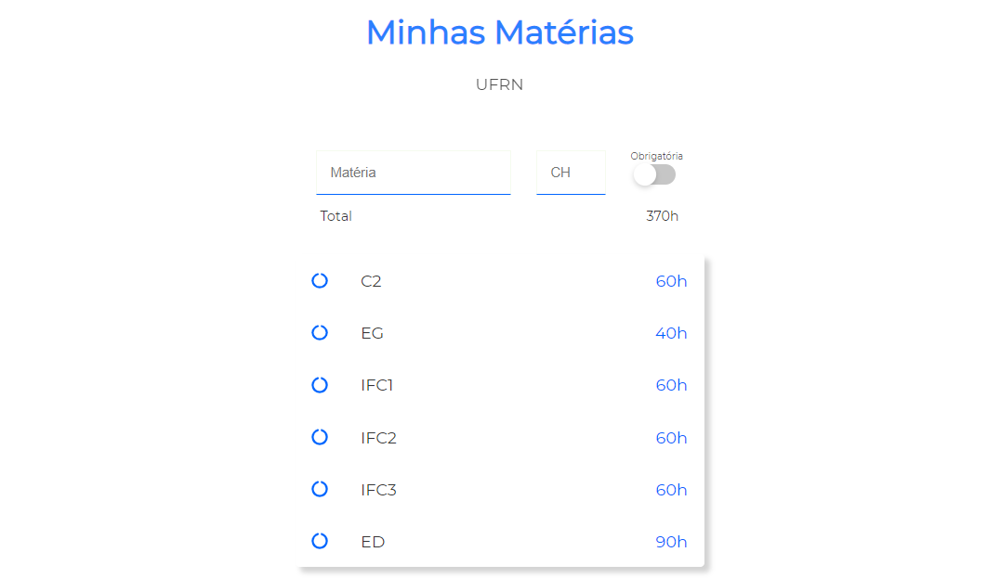

# Subjects SPA's

This project was bootstrapped with [Create React App](https://github.com/facebook/create-react-app).

## Available Scripts

In the project directory, you can run:

### `yarn start`

Runs the app in the development mode.\
Open [http://localhost:3000](http://localhost:3000) to view it in the browser.

# HTTP's code

- `200` sucesso
- `201` cadastrado com sucesso
- `204` sem dados
